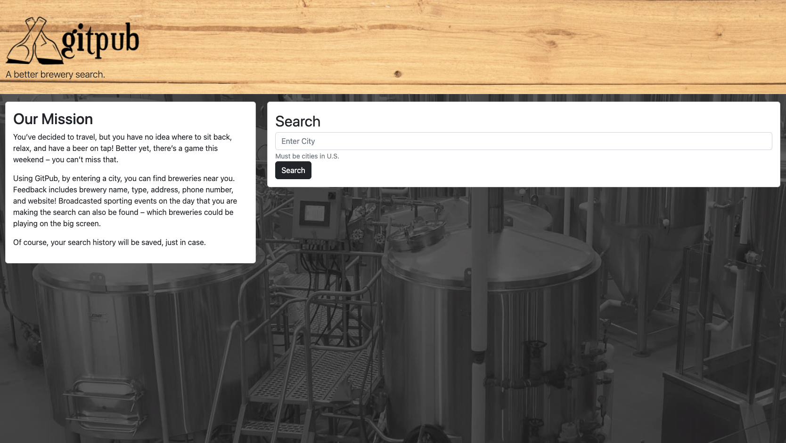
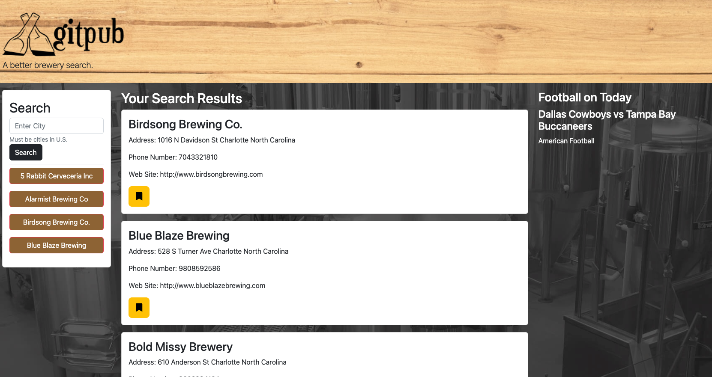

# GitPub: A brewery finder application

## Table of Contents
[Description](#description)

[Technology](#technology)

[Visuals](#visuals)

## Description

[Link to live site.](https://nsantander1095.github.io/gitpub/)

GitPub is a front end web application that uses both the Open Brewery Database and Sport Database APIs to find breweries in your city. Upon opening the live site, you will be presented with the opportunity to search for a city and then you will be taken to a page that displays all of the breweries in that city to you as well as displaying any televised American Footbal games on the day that you are using the app. From there, you can peruse the options, visits websites, and find any other information you'd like about the breweries in your area. Should you find one that suits you, you can bookmark it and your choice will be saved in local storage and there will be an element to redirect you back to that brewery's information. 

## Technology

* Bootstrap v5 Framework
* Custom CSS Stylesheet
* Open Brewery DB API
* The Sports DB API

## Visuals

